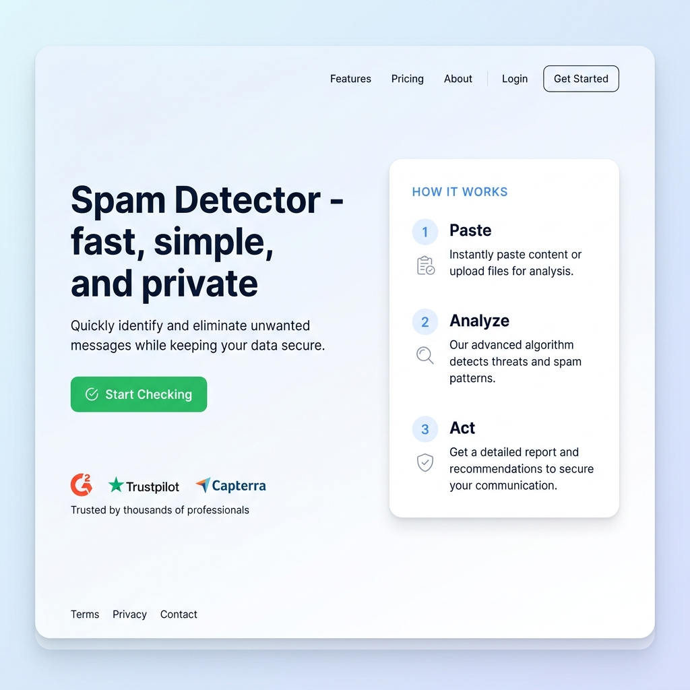
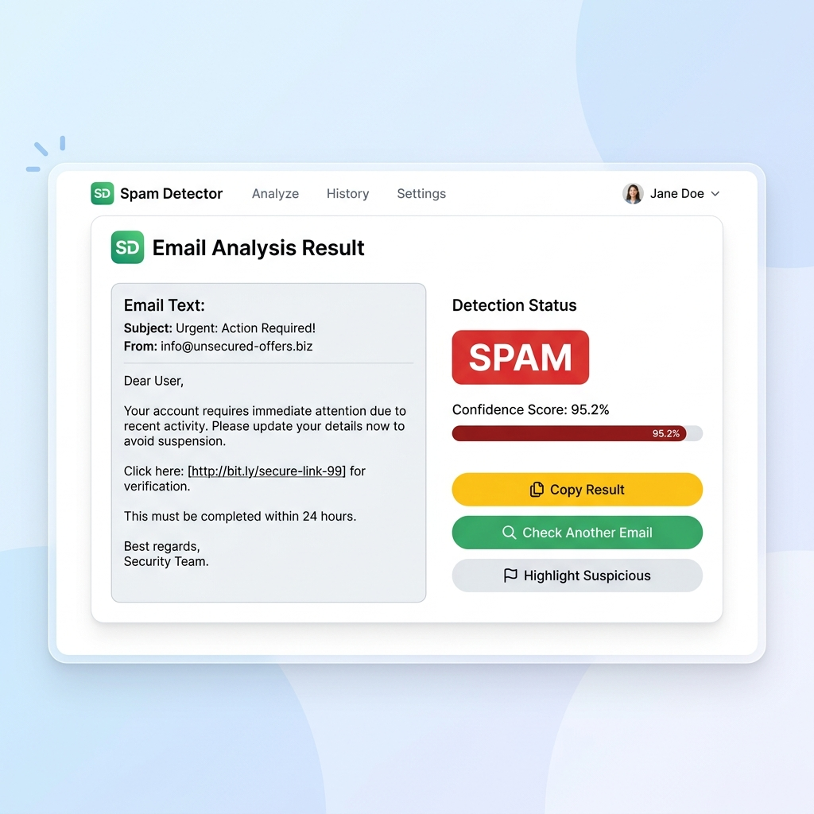

# Spam Detector with Self-Learning Feedback

[](https://github.com/Bibiayesha-Badeghar/Spam-detector/actions/workflows/tests.yml)

A Flask-based machine learning web app that classifies email or message text as spam or legitimate using TF-IDF features and a Random Forest classifier.

The project is designed as a portfolio-friendly demonstration of a complete ML workflow: data loading, model training, prediction, confidence scoring, user feedback collection, automated tests, and evaluation reporting.

## Features

- Spam vs. legitimate message classification
- Confidence score for each prediction
- Flask web interface for checking messages
- User feedback endpoint for correcting low-confidence predictions
- Retraining workflow using feedback data
- Input validation and error handling
- Automated test suite with route, model, and validation tests
- Model evaluation report with metrics and visualizations

## Screenshots

**Landing Page**



**Spam Detection Result**



## Project Structure

```text
Spam-detector/
├── app.py                          # Flask web application
├── train_model.py                  # Model training script
├── model_evaluation.py             # Evaluation script for saved model
├── dataset.json                    # 100 labeled samples: 50 spam, 50 ham
├── Dockerfile                      # Docker image definition
├── docker-compose.yml              # One-command container setup
├── EVALUATION.md                   # Model evaluation report
├── model_metrics.json              # Generated evaluation metrics
├── model_evaluation_curves.png     # ROC and precision-recall curves
├── requirements.txt                # Runtime dependencies
├── requirements-dev.txt            # Development and testing dependencies
├── pytest.ini                      # Pytest configuration
├── user_feedback.example.json      # Safe example feedback file
├── screenshots/
│   ├── landing.png                 # Landing page screenshot
│   └── result.png                  # Result page screenshot
├── templates/
│   ├── landing.html                # Home page
│   ├── index.html                  # Message input form
│   └── result.html                 # Prediction result page
└── tests/
    ├── test_app.py                 # Flask route and endpoint tests
    ├── test_model.py               # Model and dataset tests
    └── test_validation.py          # Input validation tests
```

Generated local files such as `spam_detector_model.pkl`, `vectorizer.pkl`, `user_feedback.json`, `.coverage`, `.pytest_cache/`, and `htmlcov/` are intentionally ignored by Git.

## Installation

### Prerequisites

- Python 3.7+
- pip

### Setup

```bash
cd Spam-detector
pip install -r requirements.txt
python train_model.py
python app.py
```

The app runs at:

```text
http://127.0.0.1:5000/
```

Training creates the local model artifacts:

```text
spam_detector_model.pkl
vectorizer.pkl
```

These files are generated from the dataset and are not committed to the repository.

## Development Setup

```bash
pip install -r requirements-dev.txt
pytest -v
pytest --cov=. --cov-report=html
```

Development tools:

- `pytest` for tests
- `pytest-cov` for coverage reporting
- `black` for formatting
- `flake8` for linting
- `matplotlib` and `numpy` for evaluation visualizations

## Docker

Run the entire app with a single command — no local Python installation required:

```bash
docker compose up --build
```

The app will be available at:

```text
http://localhost:5000/
```

To stop the container:

```bash
docker compose down
```

## Usage

### Web App

1. Run `python app.py`
2. Open `http://127.0.0.1:5000/`
3. Click "Start Checking"
4. Paste an email or suspicious message
5. Submit and review the prediction, confidence score, and result details

### Python Example

```python
import pickle

model = pickle.load(open("spam_detector_model.pkl", "rb"))
vectorizer = pickle.load(open("vectorizer.pkl", "rb"))

email = "Congratulations! You won $1,000,000!"
X = vectorizer.transform([email])
prediction = model.predict(X)[0]
confidence = model.predict_proba(X)[0]

print(f"SPAM: {prediction == 1}")
print(f"Confidence: {max(confidence) * 100:.1f}%")
```

## Self-Learning Feedback Flow

The app uses a confidence threshold of `0.60`.

When prediction confidence is low, the result page can ask the user for feedback. Feedback is saved locally to `user_feedback.json`, and `train_model.py` can include that feedback during retraining.

Workflow:

```text
1. User checks a message
2. Model predicts spam or legitimate
3. App shows confidence score
4. Low-confidence predictions can collect user feedback
5. Feedback is saved locally
6. Model can be retrained with original data + feedback
```

## Dataset

The included dataset contains **100 labeled samples**:

- 50 spam samples
- 50 ham/legitimate samples
- Balanced 1:1 class ratio
- English-only examples
- Mix of SMS-style and email-style messages

This is a compact educational dataset for demonstrating the full ML pipeline. For production use, the next step would be scaling evaluation to a larger, real-world dataset with at least 1,000+ diverse messages.

## Model Evaluation

The saved model currently achieves perfect metrics on the included 100-sample dataset:

| Metric | Value |
|--------|-------|
| Accuracy | 100% |
| Precision | 1.0000 |
| Recall | 1.0000 |
| F1-Score | 1.0000 |
| ROC-AUC | 1.0000 |

Important: these metrics are measured on the included project dataset, not on a large external production dataset. Perfect scores on a small dataset should be treated as a successful demo result, not proof of production-grade generalization.

For details, see [EVALUATION.md](./EVALUATION.md).

## Testing

The project currently has **58 passing tests**.

Latest local test result:

```text
58 passed
Total coverage: 62%
```

Test areas:

- Flask app routes and endpoints
- Model and vectorizer loading
- Dataset integrity
- Prediction output shape and confidence ranges
- Input validation boundaries and edge cases

Run tests:

```bash
pytest --quiet
```

Run tests with coverage:

```bash
pytest --cov=. --cov-report=html
```

## API Endpoints

| Endpoint | Method | Purpose |
|----------|--------|---------|
| `/` | GET | Landing page |
| `/checkpage` | GET | Message input form |
| `/check` | POST | Submit text for spam classification |
| `/feedback` | POST | Submit user correction |
| `/retrain` | POST | Retrain model with feedback |
| `/status` | GET | Return model and feedback status |

## Configuration

Current configuration lives in `app.py`:

```python
UNCERTAINTY_THRESHOLD = 0.60
FEEDBACK_FILE = "user_feedback.json"
```

A future production-readiness improvement is moving these values to environment variables.

## Error Handling

The app handles:

- Empty input
- Very short input
- Input longer than 10,000 characters
- Missing model files
- Invalid feedback labels
- Feedback file read/write errors

## Limitations

- Dataset is intentionally small: 100 labeled samples
- Evaluation does not yet use a large external holdout dataset
- Saved model files are generated locally and ignored by Git
- `/retrain` is available as a local demo endpoint and should be protected before deployment
- Configuration is not yet environment-based

## Roadmap

High-impact next steps:

1. Improve documentation and evaluation honesty
2. Add logging and structured error handling
3. Move configuration to environment variables
4. Add CI with GitHub Actions
5. Add Docker support
6. Evaluate on a larger real-world dataset
7. Add explainable prediction details

## License

This project is open source and available for educational purposes.

## Author

**Bibiayesha Badeghar**

- GitHub: [@Bibiayesha-Badeghar](https://github.com/Bibiayesha-Badeghar)

---

Built as a practical portfolio project for learning machine learning, Flask, testing, and production-minded engineering.
